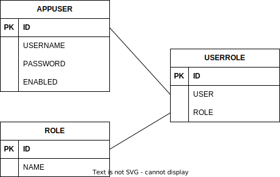

= Documentation
:toc:
:icons: font

== Application

The Application provides a login page and subpages with a navigation bar.
All Subpages are secured with spring security.
To access the paged login with the username *user* or *admin* and the password _123_.

http://localhost:8080/

=== Database

The Application use a postgres Database provided from docker.
The tables *do not* have a foreign key entered in order to minimize possible database errors.

.Entity Relationship

=== Web

The Components and Themes are from https://www.primefaces.org/

.Theme Configuration
----
joinfaces.primefaces.theme=saga
possible Themes:
- saga
- vela
- arya
----

=== Logging

Logging is done with Log4J2 and configured in log4j2.xml